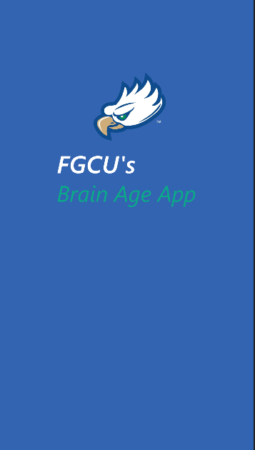
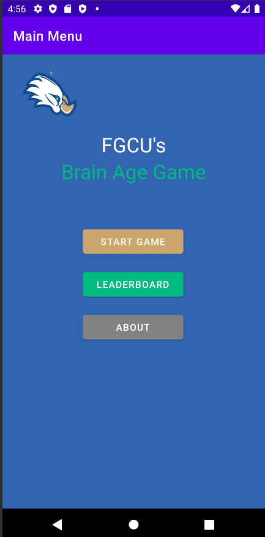
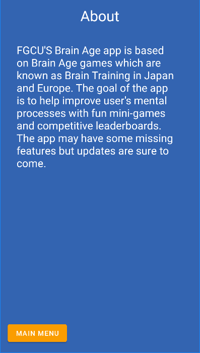
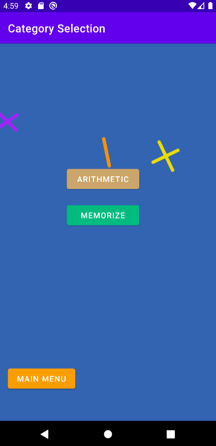
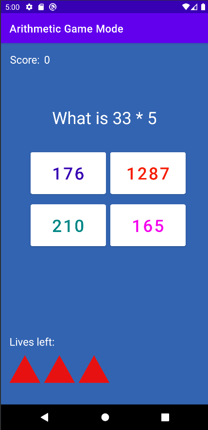
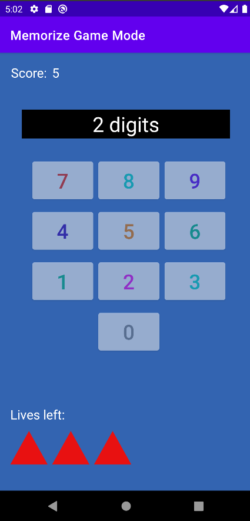
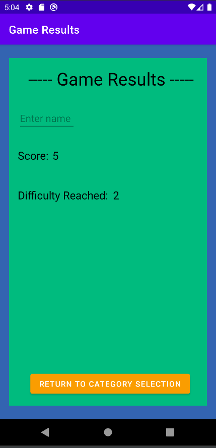
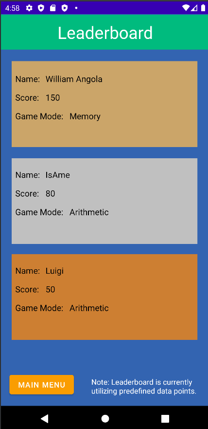

# FGCUBrainAgeApp

*FGCU's Brain Age app description -* 
This is for 2018 Batch
The Brain Age app provides user's improved mental processes with fun mini-games and competivite leaderboards. This is V1 of the app itself but updates are sure to come
The app was created using Android Studio within two days. Note: Some images format's vary depending on the functionality to be displayed.

# App Screens

### Splash Screen

### Main Menu Screen

### About Screen

### Category Selection Screen

### Arithmetic Mode Screen

### Memory Mode Screen

### Results Screen

### Leaderboard Screen

